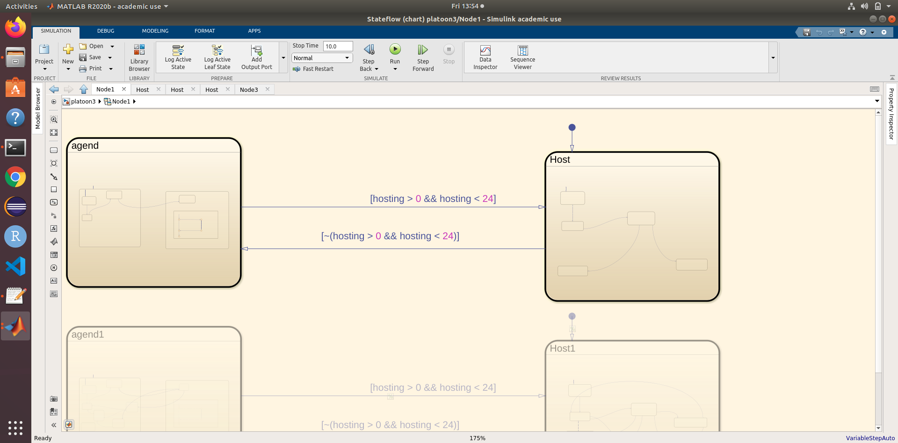
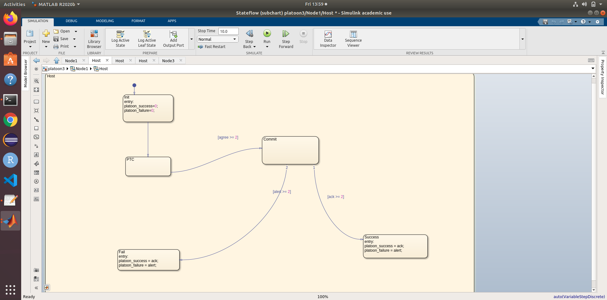
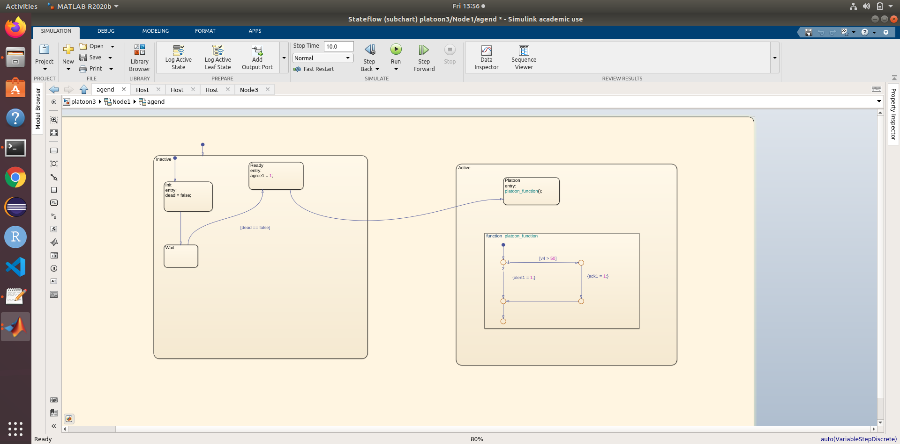
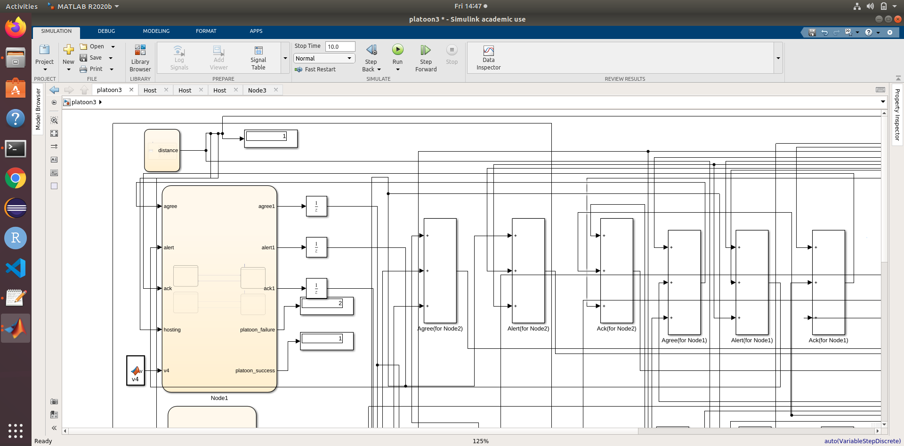
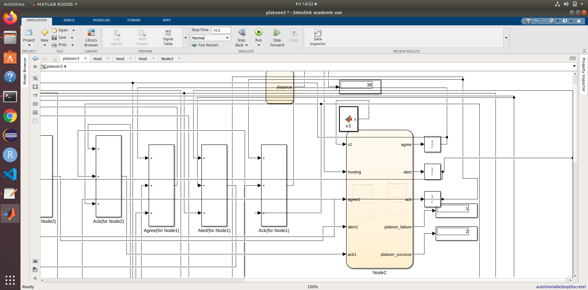

<h2>Overview</h2>
<ul>
  <li>Academic Year: 2019-2021</li>
  <li>Project Title: Dynamic platoon formation</li>
  <li>Students: Shahnawaz Khan</li>
  <li>CFUs: 6</li>
</ul>
<h2>Project Summary</h2>

I worked on distributed agreement for that we used four car, any car can be a host at particular time and all others can join a platoons as agent on that particular time.
We used logic of generating a random number with the following conditions: 

<ul>
  <li>Node 1 - hosting > 0 && hosting <= 24 </li>
  <li>Node 2 - hosting >= 25 && hosting <= 49 </li>
  <li>Node3 - hosting >= 50 && hosting <= 74 </li>
  <li>Node 4 - hosting >= 75 </li>
</ul>

<h3>Figure 1</h3>

In figure 1 we can see that this node can become host as well as agent.

<h3>Figure 2</h3>

After deciding host, nodes sends acknowledgement to join the platoon, if host receives more than two acknowledgements the platoon is successful otherwise it is declared as not possible we have shown this as platoon failure.

<h3>Figure 3</h3>

In figure 3 you can see that agent can send acknowledgment if probability is more than 50 (P>50) otherwise it will send alert that it will not join platoon.

<h3>Figure 4</h3>

Figure 4 Host is Node 1 but platoon is failure because only one car sends Acknowledge and 2 cars send alert that why platoon failure value is 2 and platoon success value is 1

<h3>Figure 5</h3>

Figure 5 Host is Node 2 and platoon is success because only one car sends Alert and 2 cars send acknowledge that why platoon success value is 2 and platoon failure value is 1

<h2>Following objectives are covered in this project.</h2>

<ul>
  <li>Model the described system with k = 4 cars, with m =2 (so platoons can be made of 2,3,4 cars): model each node of the distributed system with a statechart, and the whole system as a combination of statecharts.</li> 
  <li>Perform formal verification actions on the resulting model: in particular some interesting properties to be verified are directly defined by some of the listed requirements:
    <ul>
      <li>- (validity) if a pool of cars agrees on a destination, it means that this destination has been proposed by a car;</li> 
      <li>- (agreement) all the cars that have reached an agreement have the same destination; </li> 
      <li>- (uniqueness) it is not possible that two pools form with two different destination.</li> 
    </ul>
  </li>
  </ul>

